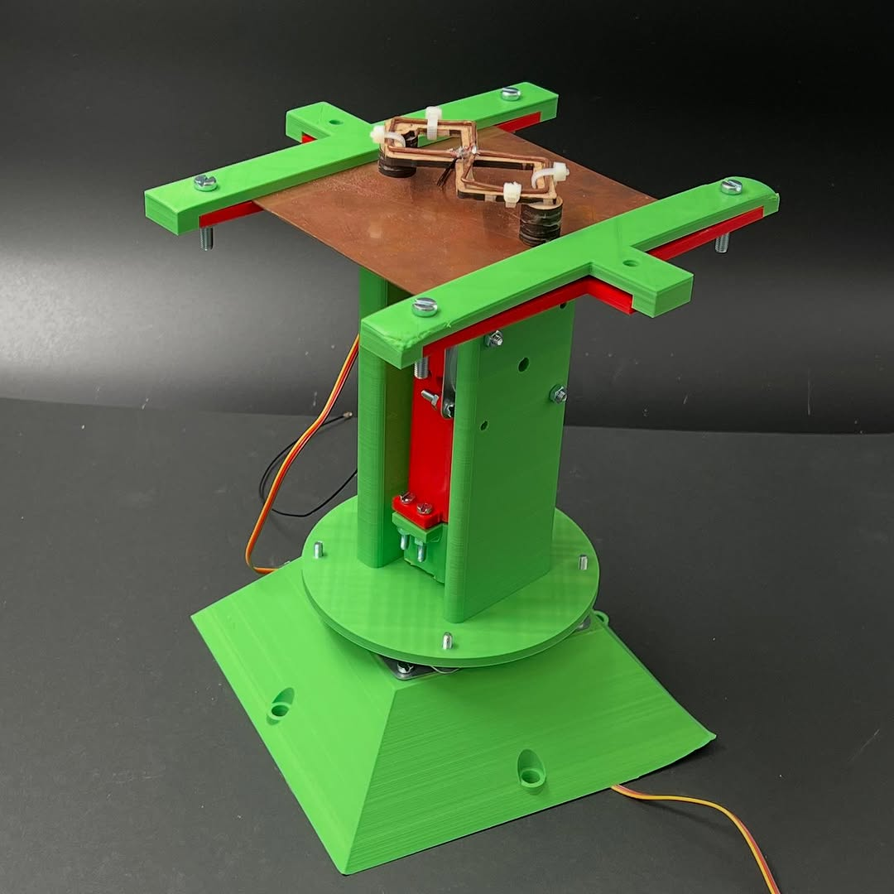
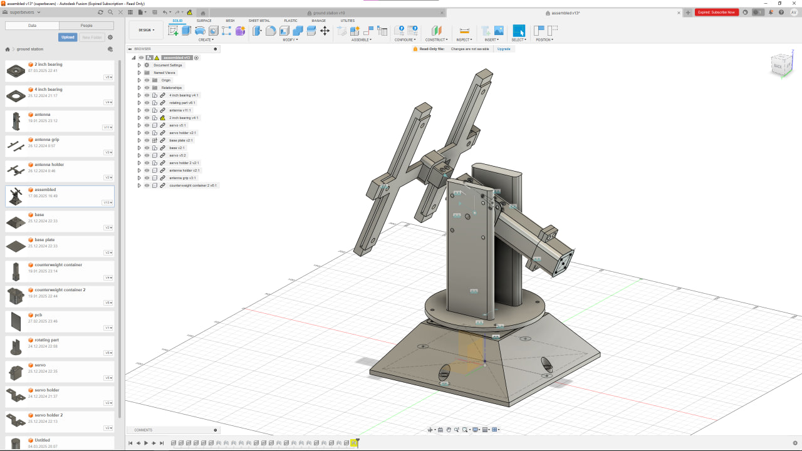

# CanSat Ground Station Firmware

ESP32 firmware used to receive CanSat telemetry, read ground station GPS, control a directional antenna (2 servos), and forward decoded data to a PC over USB serial.

## What it does
- Receives telemetry packets from the CanSat over radio
- Outputs decoded telemetry to USB serial
- Reads ground station GPS position
- Controls base + elevation servos for antenna pointing
- Reports RSSI and servo angles as telemetry fields

## Files
- `ground-station.ino` – main firmware
- `config.h` – pins, telemetry IDs, configuration
- `globals.*` – shared state
- `gps.*` – GPS parsing
- `servo_control.*` – servo control
- `data_processing.*` – packet decoding and output

## Serial output
(field_id) (timestamp) (value)
Used by the Python map UI and CSV logger.

## Build
Open `ground-station.ino` in Arduino IDE, select ESP32 board, install required libraries, upload.  
USB serial baud rate: **115200**.

## Notes
Configuration is done in `config.h`.  
Error handling is minimal to keep the main loop non-blocking during live operation.

## Hardware

3D-printed, servo-driven antenna mount used by the ground station.

